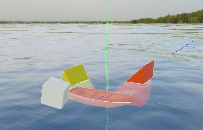
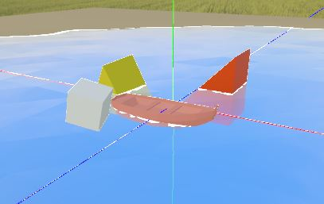
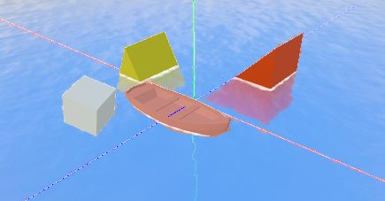
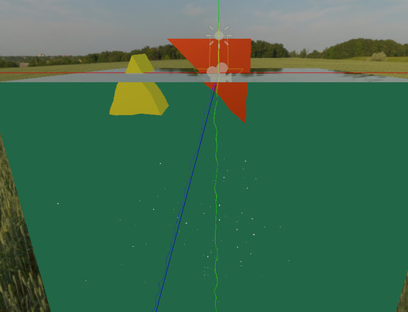

WORK IN PROCESS

godot water package for godot 3.0 ,under MIT LICENESE.

<!--  -->

## usage
use preset in “./addons/water_pack/preset/”

## TODO
- [ ] work not started
- [ ] * work in process
- [x] achieve

render
- [x] wave
- [x] transprant 
    - [x] reflaction
    - [x] fade
- [x] screen rain
- [x] Foam
- [x] fresnel
- [ ] * reflection
- [x] ripples
- [ ] * under water
- [ ] * lod

physic
- [ ] Buoyancy 
- [ ] water flow
- [ ] object move with water
- [ ] wind area effect
- [ ] sound
- [ ] NavMesh

demo
- [x] ocean
- [x] river
- [ ] strong river
- [x] lake
- [ ] under/up water switch
- [ ] wet ground
- [ ] drop stone to water
- [x] waterfall
- [ ] stone in water
- [ ] boat on water
- [ ] 2d water
- [x] 2.5d water
- [x] lowpoly water
- [ ] infinite ocean
- [ ] rain and hit water/gound 

other
- [ ] release to godot asset library
- [ ] doc
    - image/video 
    - web demo
- [ ] setting menu 
    - day/night env
    - water
    - scene selection

## Contributors
- ywaby
- SIsilicon

## reference
