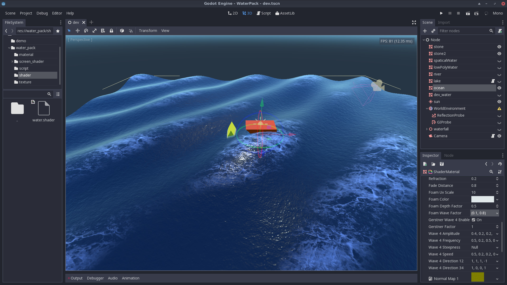

WORK IN PROCESS

godot water package

LICENESE under MIT

need godot version 3.0

<!--  -->

## usage

## TODO
- [ ] work not started
- [ ] * work in process
- [x] achieve

render
- [x] wave
- [x] transprant 
    - [x] reflaction
    - [x] fade
- [x] screen rain
- [x] Foam
- [ ] * reflection
- [ ] * fresnel
- [ ] * ripples
- [ ] under water
- [ ] lod

physic
- [ ] Buoyancy 
- [ ] water flow
- [ ] object move with water
- [ ] wind area effect
- [ ] sound
- [ ] NavMesh

demo
- [ ] ocean
- [ ] river
- [ ] strong river
- [ ] lake
- [ ] under/up water switch
- [ ] wet gound
- [ ] drop cube
- [ ] drop pipe water
- [ ] waterfall
- [ ] stone in water
- [ ] boat on water
- [ ] 2d water
- [ ] 2.5d water
- [ ] lowpoly water
- [ ] infinite ocean
- [ ] rian and hit water/gound 

other
- [ ] relasea to godot asset library
- [ ] doc
    - image/video 
    - web demo
- [ ] setting menu 
    - day/night env
    - water
    - scene selection

## Contributors
- ywaby
- SIsilicon

## refernce
