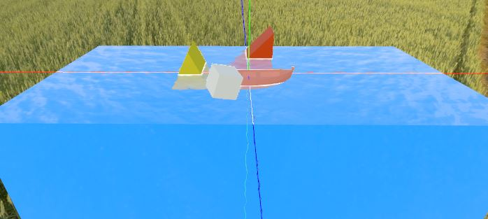

WORK IN PROGESS

Godot water package for godot 3.1, under MIT LICENESE.

<!--  -->

## Installation

Simply put the `water_pack` folder(the one inside the addons folder) into your project's `addons` folder. Simple as that!

## Usage

All 3D Water bodies are accessible under `Spatial`, while `Water2D` is under `Node2D`.

Other effects such as waterfall and rain are currently incomplete presets. They'll be completed eventually.

## Todo
- [ ] work not started
- [ ] * work in process
- [x] achieve

render
- [x] wave
- [x] transparant 
    - [x] reflection
    - [x] fade
- [x] screen rain
- [x] foam
- [x] fresnel
- [x] reflection
- [x] ripples
- [x] under water
- [x] lod

physic
- [x] buoyancy 
- [ ] water flow
- [x] object move with water
- [ ] wind area effect
- [ ] sound
- [ ] NavMesh

demo
- [x] ocean
- [x] river
- [ ] strong river
- [x] lake
- [x] under/up water switch
- [x] wet ground
- [ ] drop stone to water
- [x] waterfall
- [ ] stone in water
- [x] boat on water
- [x] 2d water
- [x] 2.5d water
- [x] lowpoly water
- [x] infinite ocean
- [ ] * rain and hit water/gound 

other
- [ ] * release to the Godot asset library
- [ ] doc
    - image/video 
    - web demo
- [ ] setting menu 
    - day/night env
    - water
    - scene selection

## Contributors
- ywaby
- SIsilicon

## reference
